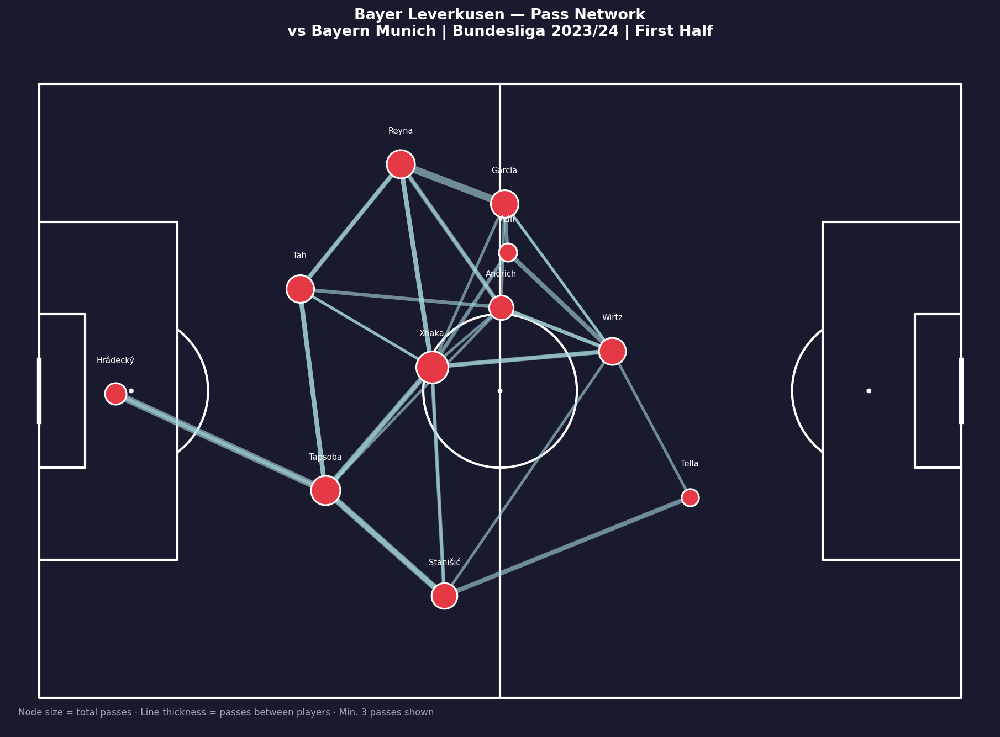

# Bayer Leverkusen — Match Analysis
## Bundesliga 2023/24 | vs Bayern Munich

A football analytics project using StatsBomb open data to analyse 
Bayer Leverkusen's historic unbeaten title-winning season.

---

## Visualisations

### Shot Map


- Blue bubbles = Leverkusen shots
- Orange bubbles = Bayern Munich shots  
- Red bubbles = Goals
- Bubble size = xG value

**Key insight:** Leverkusen dominated shot quality with 3 goals 
from high-xG positions inside the box. Bayern's best chance 
was Sacha Boey's 0.23 xG effort.

---

### Pass Network — First Half


- Node size = total passes by player
- Line thickness = passes between two players
- Minimum 3 passes shown

**Key insight:** Granit Xhaka was the central hub with 36 passes, 
connecting defence and attack. Florian Wirtz positioned highest, 
acting as the creative outlet in the final third.

---

## Tools & Data
- **Data:** StatsBomb open data (free)
- **Language:** Python 3.12
- **Libraries:** `statsbombpy`, `mplsoccer`, `matplotlib`, `pandas`

---

## How to run
```bash
pip install statsbombpy mplsoccer matplotlib pandas
python3 shot_map.py
python3 pass_network.py
```
