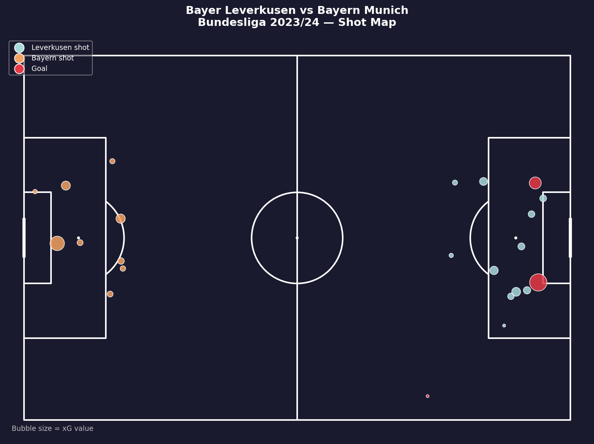

# Bayer Leverkusen — Shot Map
## Bundesliga 2023/24 | vs Bayern Munich

Shot map analysis using StatsBomb open data to visualise 
shot quality and xG in Leverkusen's title-winning season.

---

## Visualisation

- Blue bubbles = Leverkusen shots
- Orange bubbles = Bayern Munich shots
- Red bubbles = Goals
- Bubble size = xG value

**Key insight:** Leverkusen dominated shot quality with 3 goals 
from high-xG positions inside the box. Bayern's best chance 
was Sacha Boey's 0.23 xG effort.

--
